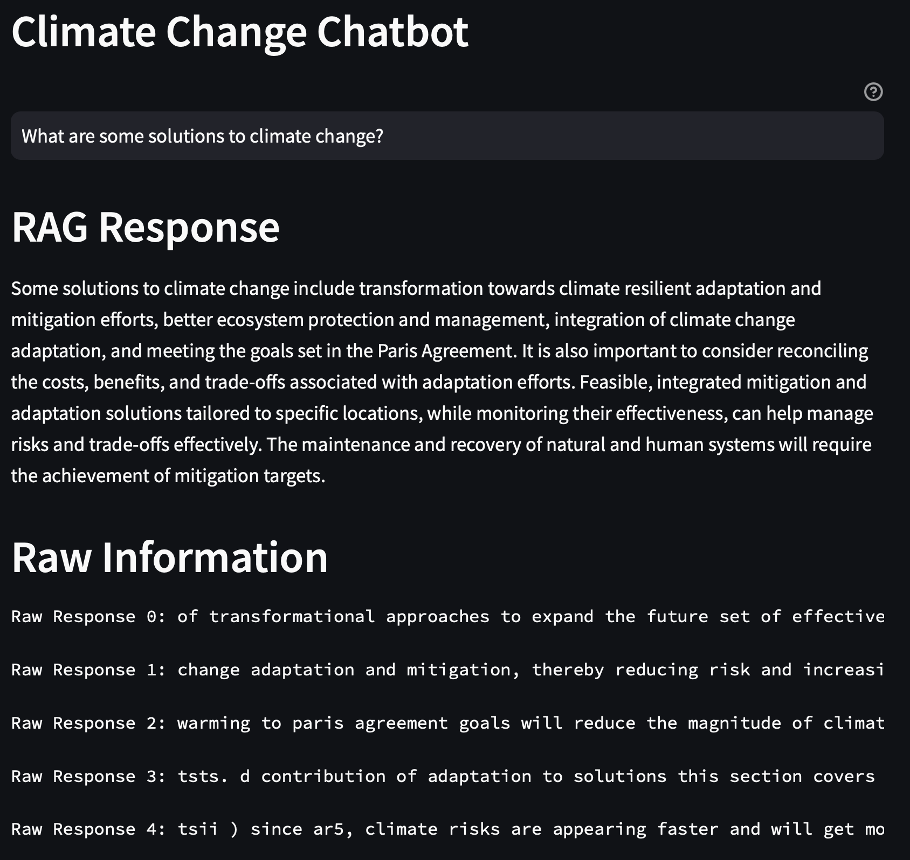

# Climate-Change-RAG-ChatBot
 
This project makes use of a ChromaDB vector database, OpenAI API, and an IPCC (Intergovernmental Panel on Climate Change) pdf document to build a RAG-enhanced chatbot which can answer questions about climate change with high accuracy. It is then run as a streamlit app to add interactivity.

 